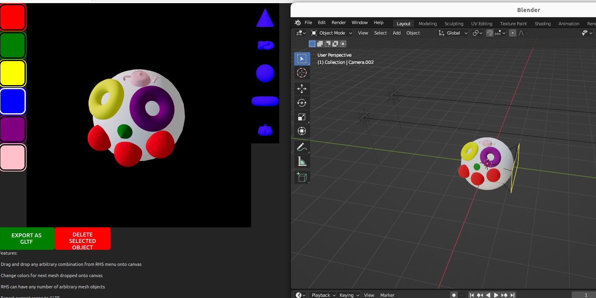

Couple ways to run this:
- Compiled assets are in `dist/`, index.html should run em but if you just open in most modern web browsers you'll likely get a CORS error blocking you. You can either look up how to disable this (very important!) security check for your particular browser, or try one of the following options.

- If you have `docker` installed on your system already - then huzzah! You should be able to run this nice & easy. If you don't, then installing docker & running the following commands should get it up and running  on your system.

	- If you can run shell scripts on your machine, then executing `./run.sh` should get everything running (will take ~3-5 mins), then just visit http://localhost:4173/ (if you're on linux it should open by default)
	- If you can't run shell scripts on your machine, then just run the following commands:

		> docker build -t dragdropdemo .
		
		> docker run -d -p 4173:4173 dragdropdemo

		then visit http://localhost:4173/ with your web browser

- If you don't want to install docker but you have yarn/npm installed on your machine, then you can manually run

        > yarn install -D vite
        > yarn preview

  to compile everything & boot up a local web server. Then visit http://localhost:4173/ with your web browser
  
  
